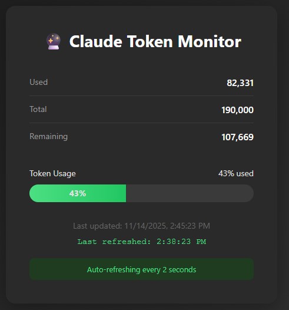
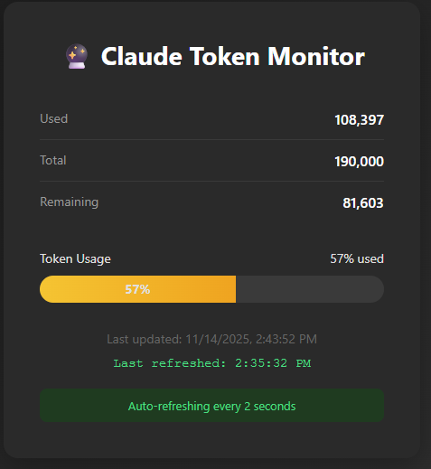

# Claude Token Monitor

A clever hack to expose Claude Desktop's internal token usage data through an external dashboard.

## The Problem

Claude Desktop tracks token usage internally but doesn't show it to users. System warnings about token consumption are visible to Claude but hidden from the UI. Users hit the context limit unexpectedly, losing work mid-conversation.

## The Discovery

During testing, we found that Claude can see system warnings after tool calls:
```xml
<system_warning>Token usage: X/Y; Z remaining</system_warning>
```

These warnings are injected by Anthropic's backend but only visible in Claude's context window, not exposed to users.

## The Solution

This project bridges the visibility gap using three components:

1. **A Custom Skill** - Instructs Claude to extract token data from system warnings and write to a JSON file
2. **A Live Dashboard** - HTML page that polls the JSON file and displays real-time usage
3. **A Launch Script** - Simple automation to start the server and open the dashboard

### Architecture

```
Anthropic API
    ↓
System warning appears in Claude's context
    ↓
Custom skill triggers automatically
    ↓
Claude writes token data to JSON file
    ↓
Dashboard polls file every 2 seconds
    ↓
User sees live token usage
```

## How It Works

### Component 1: The Skill

A Claude Desktop skill monitors for system warnings and silently writes token data to a JSON file. The skill uses Claude's Filesystem tools to update the file without user interaction.

**Key insight:** Skills can instruct Claude to perform silent, automatic actions whenever specific patterns appear in context.

### Component 2: The Dashboard

A simple HTML page with JavaScript that:
- Polls a JSON file every 2 seconds
- Displays token usage with a color-coded progress bar
- Green (>50% remaining) → Yellow (20-50%) → Red (<20%)
- Shows used/total/remaining tokens with formatted numbers

### Component 3: The Launch Script

A batch/shell script that:
1. Starts a local web server (Python's built-in HTTP server)
2. Opens the dashboard in a browser window
3. Provides a clean, app-like experience

## What This Reveals

This hack exposes several interesting aspects of Claude's architecture:

1. **System warnings exist** - Anthropic tracks token usage internally and injects warnings into Claude's context
2. **Skills enable side effects** - Skills can instruct persistent, automatic behaviors beyond simple Q&A
3. **Branching conversations have separate token counts** - Editing messages creates new branches with independent budgets
4. **API vs Client distinction** - The API returns raw usage data; clients format it as "warnings"
5. **Tool calls trigger updates** - Warnings appear after tool use, not every message

## Why This Matters

**For users:** Visibility into token consumption prevents unexpected conversation termination and enables better planning.

**For developers:** Demonstrates emergent capabilities from composing existing tools (skills + filesystem access + web dashboard).

**For AI safety:** Shows how internal system state can be extracted through creative tool composition, even when not explicitly exposed.

## Limitations

- Only works with Claude Desktop (requires custom skills support)
- Updates only after tool calls (not continuous)
- Requires local web server setup
- Skill must be loaded at conversation start to work automatically
- Paths are system-specific and need configuration

## Implementation

See `IMPLEMENTATION.md` for detailed setup instructions (not included in public repo to protect personal information).

## Broader Implications

This project demonstrates a pattern where users discover emergent system capabilities by combining tools in ways vendors didn't anticipate. Similar techniques could expose other internal states:
- Error patterns Claude sees but users don't
- Internal reasoning steps
- Tool call performance metrics
- Conversation branch structure

## Credits

Discovered and implemented during a conversation about AI system observability and the gap between what AI models can see versus what users can access.

## License

MIT License - Feel free to adapt and improve!

## Example Code

This repository includes example files to help you implement your own token monitor:

### Dashboard (`dashboard.html.example`)
A complete HTML page with:
- Real-time token usage display
- Color-coded progress bar (green/yellow/red)
- Auto-refresh every 2 seconds
- Clean, dark-themed interface

### Web Server (`serve-monitor.py.example`)
Simple Python HTTP server:
- Suppresses request logging for clean output
- Redirects root path to dashboard
- Runs on port 8080 by default

### Launch Scripts
- `launch-monitor.bat.example` - Windows launcher
- `launch-monitor.sh.example` - Linux/Mac launcher

Both scripts:
1. Start the web server
2. Open the dashboard in a browser window
3. Provide one-click startup

**Note:** All example files contain placeholder paths. You'll need to customize them for your system.

## Setting Up the Skill

The monitoring system requires a custom Claude Desktop skill to work. Skills are extensions that provide Claude with specialized instructions.

**About Claude Skills:**
- Skills extend Claude's capabilities with domain-specific knowledge
- They're loaded at the start of each conversation
- They can instruct Claude to perform automatic, silent actions
- Documentation: https://support.claude.com/en/articles/10249342-how-do-i-add-a-skill-to-my-claude-project

**For this project, the skill:**
1. Monitors Claude's context for system warnings
2. Extracts token usage data (used/total/remaining)
3. Silently writes to a JSON file using Filesystem tools
4. Requires no user interaction once loaded

The skill itself is not included in this repository as it contains system-specific paths. See the "How It Works" section above for the conceptual approach.


### Green Zone (>50% remaining)

*Dashboard showing healthy token usage with plenty of context remaining*

### Yellow Zone (20-50% remaining)

*Dashboard warning that you're approaching the context limit*

The progress bar changes color based on remaining tokens:
- **Green**: >50% remaining (safe zone)
- **Yellow**: 20-50% remaining (caution - plan to wrap up)
- **Red**: <20% remaining (danger - close to limit)

## Quick Start

1. **Customize the example files** for your system paths
2. **Create a custom skill** following the architecture described above
3. **Install the skill** in Claude Desktop
4. **Run the launch script** to start monitoring
5. **Start a conversation** in Claude Desktop with the skill loaded

The dashboard will automatically update as you use Claude and tool calls trigger system warnings.
